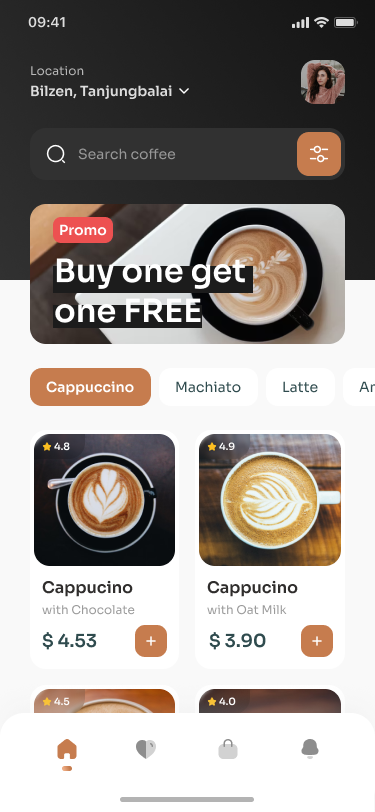
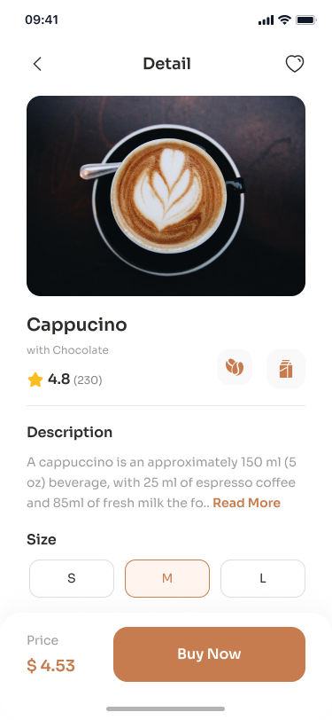
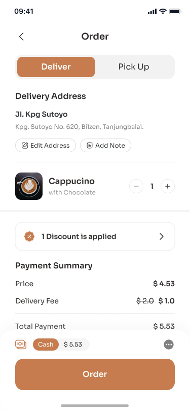
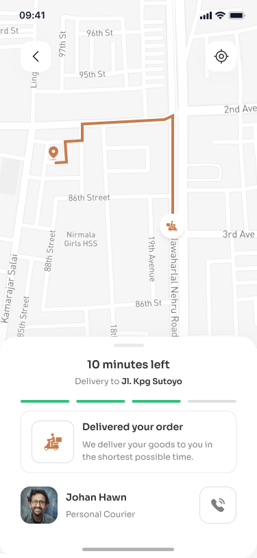

# CoffeeStoreApp - Flutter

CoffeeStoreApp is a mobile application developed using Flutter that allows users to browse and order coffee products from a virtual store. The app follows the principles of clean architecture to ensure a modular and maintainable codebase.

## Overview

CoffeeStoreApp consists of five main screens:

1. **Start Page**: The start page serves as the entry point to the app and provides users with an introduction to the coffee store.

2. **Dashboard**: The dashboard screen displays various coffee products available for purchase, promotions, and other relevant information.

3. **Details Page**: The details page provides users with detailed information about a specific coffee product, including its name, description, price, and rating.

4. **Order Page**: The order page allows users to view and manage their orders, including adding or removing items from the cart.

5. **Delivery Page**: The delivery page enables users to track the delivery status of their orders and view estimated delivery times.

## Features

- Intuitive navigation between screens using a bottom navigation bar.
- Seamless integration of Google Fonts for consistent typography throughout the app.
- SVG image support for high-quality and scalable graphics.
- Dynamic grid layout using the `flutter_staggered_grid_view` package for a visually appealing dashboard.

## Screenshots

## Getting Started

1. Clone the repository to your local machine.
2. Navigate to the project directory and run `flutter pub get` to install dependencies.
3. Connect your device or start an emulator.
4. Run the app using `flutter run`.

## Dependencies

CoffeeStoreApp relies on the following packages:

- `cupertino_icons`: Provides the Cupertino themed icons used throughout the app.
- `google_fonts`: Allows integration of custom Google Fonts for enhanced typography.
- `flutter_svg`: Enables rendering of SVG images within the app.
- `flutter_staggered_grid_view`: Facilitates the creation of dynamic grid layouts.

## Contribution

Contributions to CoffeeStoreApp are welcome! If you encounter any issues or have suggestions for improvement, feel free to open an issue or submit a pull request. Your contributions will help enhance the functionality and user experience of the app.
